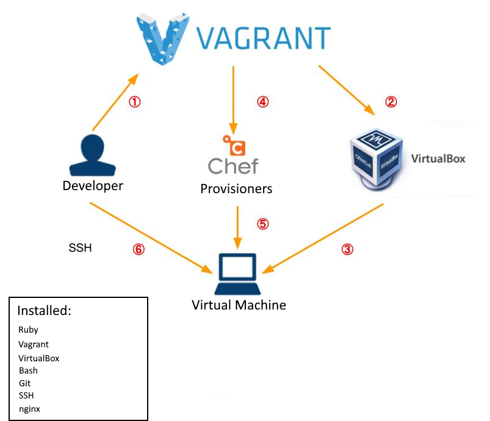

`Usage: vagrant [options] <command> [<args>]`
```bash
    -v, --version                    Print the version and exit.
    -h, --help                       Print this help.

Common commands:
     box             manages boxes: installation, removal, etc.
     cloud           manages everything related to Vagrant Cloud
     destroy         stops and deletes all traces of the vagrant machine
     global-status   outputs status Vagrant environments for this user
     halt            stops the vagrant machine
     help            shows the help for a subcommand
     init            initializes a new Vagrant environment by creating a Vagrantfile
     login
     package         packages a running vagrant environment into a box
     plugin          manages plugins: install, uninstall, update, etc.
     port            displays information about guest port mappings
     powershell      connects to machine via powershell remoting
     provision       provisions the vagrant machine
     push            deploys code in this environment to a configured destination
     rdp             connects to machine via RDP
     reload          restarts vagrant machine, loads new Vagrantfile configuration
     resume          resume a suspended vagrant machine
     snapshot        manages snapshots: saving, restoring, etc.
     ssh             connects to machine via SSH
     ssh-config      outputs OpenSSH valid configuration to connect to the machine
     status          outputs status of the vagrant machine
     suspend         suspends the machine
     up              starts and provisions the vagrant environment
     upload          upload to machine via communicator
     validate        validates the Vagrantfile
     version         prints current and latest Vagrant version
     winrm           executes commands on a machine via WinRM
     winrm-config    outputs WinRM configuration to connect to the machine
```
- Confirm if you have internet in VM
    `sudo apt-get update`
- Run upgrade
    `sudo apt-get upgrade -y`
- Where am I `pwd` gives current location
- Whoami `uname` or `uname -a`
- How to create a file in linux `touch filename`
- How to check file/folder available in current location
- `ls` to check files in current location or `ls -a` for all files includin hidden
- How to create a folder `mkdir folder_name`
- How to navigate to folder `cd folder_name`
- how to navigate back `cd ..` for once, `cd` for all
- How to delete a file/folder `rm -rf file/foldername` - force
- Copy file from 1 location to another `cp sourcefile destination`
- How to navigate between OS and VM
  - To exit VM, `exit`
- For Admin access we can use `sudo`
  - To switch to admin mode `sudo su` su - super user
- To change permissions of a file `chmod instruction filename`
  - To allow all access `chmod 700 test.txt` (700 allows all)
  - To make executable `+x`
- Open task manager `top` or `ps aux` (close with "x" or Ctrl + C)
- To remove any process `kill PID` - `kill 7`
- How to delte folder/hidden folder `ls -a`
- Print the first 3 lines from the test.txt
- Print the last 3 lines from the test.txt
  - `tail -n amount filename`
- Print the first 10 lines from the test.txt
  - `head -n amount filename`
- Research how to use `|` - pipe sign and `grep` and `sort`
  - pipe `|` - takes output of one command and use it as input for another
  - `grep` - searching for string/character in the specified file
    - `grep string filename`
  - `sort` - sorts filename by a given key with an additional option
    - `sort filename` - sorts alphabetically
    - `sort filename > output.txt` - sorts alphabetically and outputs to output file
      - or use option -o `sort -o filename output.txt`
    - `sort -r filename` - reverse order
- `ps aux` sort list by name
- How to create/run a process in the background & foreground, create/run a process in both areas
- Kill the process that you created

- Install `nginx` in our VM
- Create a `private-network` between localhost and VM
- Allocate IP address
- `sudo apt-get install nginx -y`
- How to check a tool/ software status in Linux
  - `sudo systemctl status nginx`

## What is virtualisation & benefits of it


Virtualization is the process of running a virtual instance of a computer system in a layer separate from the actual hardware. It is often inefficient and costly for organizations to deploy multiple servers to keep pace with their storage and processing needs.

### Benefits

- Reduced upfront hardware and continuing operating costs
- Minimized or eliminated downtime
- Increased IT productivity and responsiveness
- Greater business continuity and disaster recovery response
- Simplified data center management
- Faster provisioning of applications and resources

## What is Development Environment

A development environment in software and web development is a workspace for developers to make changes without breaking anything in a live environment.

## What is Vagrant

Tool for working with virtual environments, and in most circumstances, this means working with virtual machines. Vagrant provides a simple and easy to use command-line client for managing these environments, and an interpreter for the text-based definitions of what each environment looks like, called Vagrantfiles. Vagrant is open source, which means that anyone can download it, modify it, and share it freely.

## What is Virtual Box

VirtualBox is open-source software for virtualizing the x86 computing architecture. It acts as a hypervisor, creating a VM (virtual machine) where the user can run another OS (operating system).

## Why should we use them all
